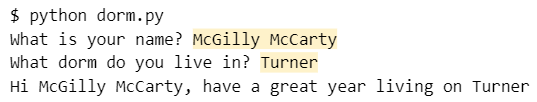

# Input/Output Assignment Section 2

## Part 1 - Variables

Variables store data. To assign a value to a variable you should use the format below

```python
name = "Ryan"
```

The variable will then be stored in the computer for the duration of the program. Any time that we want to access the value we stored, all we have to do is use <code>name</code>, and the computer will automatically insert Ryan. We will see the power of this ability in a little bit.

We can print out the value of a variable using <code>print()</code>

```python
print(name)
```

The print function can also print out multiple items if they are separated by commas or plus signs (+).

```python
print("My name is " + name)
```

### To try it out:
1. add the three lines of code to the file
2. use the command:
> $ python input.py



## Part 2 - Input

What if we want to get our data from the current user? We can use a function called <code>input()</code>. The input function prompts the user, then waits for the user to type something in the terminal window, followed by the <code>[Enter]</code> key. Then the input function "returns" whatever the user typed so that it can be stored in a variable.

In order to ask the user a question with the <code>input()</code> function, add a **prompt** message in the parenthesis. Remember that a string (a sequence of characters) must be in quotes.

For example:

```python
username = input("What is your username?")
```

After this line of code, *username* will contain whatever the user enters.

Edit the file input.py in the text editor so that the program will
1. allow the user to input their name (use the input function)
2. print precisely <code>hello, [name]! </code> where [name] is the name the user inputted.
3. Hint: Look back at part 1 to remind yourself how to print out a variable.

Example of what happens when your program is run:

```
What is your name? McGee
Hello, McGee!
```

### To run the file
> $ python input.py



## Part 3 - Input/Output Program

Write a program called **dorm.py** which meets the following criteria:
1. ask the user another question: "What dorm do you live in?"
2. print the name of the dorm to the console along with a message which welcomes them back to campus.


Example of what happens when your program is run (user input is highlighted in yellow):




Submit your program to the assignment on Canvas.