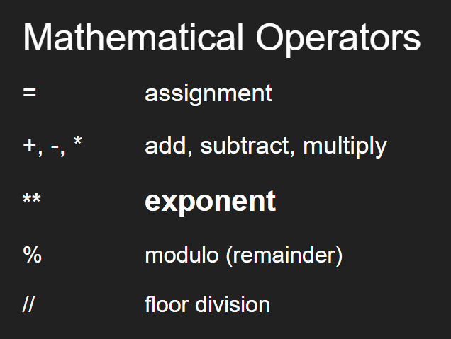
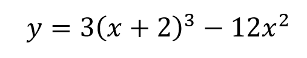

# Variable Types

## Part 1 - Types of variables
In python, there are 4 (main) primitive variable types. They are:
1. <code>string</code> - a string is a sequence of characters wrapped in quotes

2. <code>int</code> - an int (integer) can be positive, negative, or zero, but has no decimal part

3. <code>float</code> - a float a number with a decimal part

4. <code>bool</code> - a bool (Boolean) can only be **True** or **False** (without quotes)

These variables are shown in the file called <code>variables.py</code>

Before running the code, try to predict what type each of the variables will be.

To run the program, remember to use
> $ python variables.py



## Part 2 - Using operators with variables

Below is a list of common operators used in mathematics. In python, these operators can be used to work with variables that are numbers.

**Reminder:** the two type of variables which store numbers are **int** and **float**!



## Part 3 - Try it yourself

Create a program called <code>operators.py</code> which takes an input from the user and stores it in a variable called 'x'.

Convert that variable from a **string** to a **float** using the following line of code.

    x = float(x)

Calculate a value for a new variable called 'y' using the following equation:



    y = 3*((x+2)**3) - 12*x**2



Remember to run the file. You should test it with some simple values.
> $ python operators.py



## Part 4 - Submit

Download this file using the <code>...</code> next to the file name (in the folder).
Upload the file to canvas under the assignment **03 Variables.**